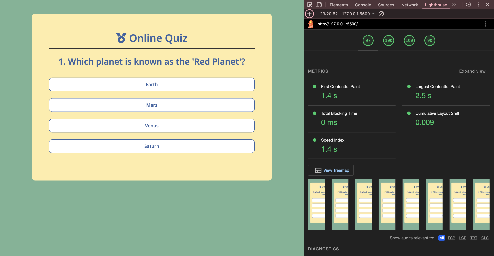

# Online Quiz
Online Quiz is a site with four easy questions to test your knowledge of general topics! Build with HTML, CSS and JavaScript.

 
 ### **User Story**
As a user, I want to take a quiz online and to test my knowledge about general topics.
# Features
## Existing Features 
  
 + **The Online Quiz Logo and Heading**

 The Online Quiz Logo is on the top of the page, harmonized with the next Heading (Question).
 

+ **Form Space and Next Question**

Form Space is defined by four questions with four options for each of them.
The section will allow user to play the quiz immeditely and with the Next Question button, the user can see next question and at the end of the quiz their final result.

*Next question button*

+ **The Score Space**

This section is showing the user how many correct answers they have gotten.

# Testing

## Validation

 ### **JavaScript**
 + script.js:

 There are 6 functions in this file.

 | Key Functions | Description | Input | 
|---------------|-------------|-------|
|startGame();          |    The Online Quiz is functioning and it shows the first question of the quiz.         |  Pass     | 
|showQuestion();   |  The showQuestion() function is responsible for displaying the current question and its possible answers in the quiz interface.           |  Pass     |         
|resetState();            |  The resetState() is responsible  for clearing state before a new  question.        |  Pass     |
|selectAnswer(e);|  By selectAnswer(), we could see combination of JS and CSS, as reaction if the respond on the question was right or wrong(Red and Green colors).  | Pass |
|showResult();|  The showResult() function is called at the end of the quiz to display the user’s final score or performance summary.     | Pass |
|handleNextButton();|The handleNextButton() function is triggered when the user clicks the "Next" button after answering a question. | Pass |

 ### **HTML**
 No errors were returned when passing through the official [W3C validator](https://validator.w3.org/)
 

 ### **CSS**
No errors were returned when passing through the official [Jigsaw validator](https://jigsaw.w3.org/css-validator/)

**Lighthouse**

## Functional Testing
| Action | Expected Behaviours | Pass/Fail |
|--------|---------------------|------------|
|Click on link to website    | Open Online Quiz page                     |    Pass        |        
|Click on "Earth","Venus" or "Saturn" answer   |Change into the red color                       |      Pass      |       
|Click on "Mars" answer    |Change into the green color          |     Pass       |        
|Click on Next Question button    |Go to the next question                  |  Pass          |
|Click on "Brazil", "Egypt" or "Argentina" answer   |Change into the red color               |         Pass   |       
|Click on "Mali" answer    |Change into the green color                   |      Pass      |        
|Click on "Japan" answer  |Change into the green color                 |        Pass    |
|Click on "China", "Thailand" or "South Korea" answer      |Change into the red color                 |       Pass     |       
|Click on "Vienna", "Madrid" or Belgrade" answer      |Change into the red color            |   Pass         |        
|Click on "Lisbon" answer   |Change into the green color                    |    Pass        |
|Click on "Play Again" button    |Return on the begginging of the Online Quiz             |      Pass      |       

 ## Deployment
 The live link can be found here [Online Quiz](https://indiica.github.io/online-quiz/)

**Publishing**
1. Click on Settings button in Github Repo
2. In section *"Code and automation"* click on *"Pages"* button
3. Select *"main"* in the branch
4. Save the changes

**Cloning**
1. Click on Code button in Github Repo
2. Click Copy button to copy url to clipboard
3. Open terminal(Mac) or Command Promt (Windows)
4. Enter: git clone -Paste-

 ## Credit
**Content**

The YouTube tutorial that has inspired me. [YouTube tutorial](https://www.youtube.com/watch?v=PBcqGxrr9g8)

**Media**

All icons were used from [Font Awesome](https://fontawesome.com)

The Font "Noto Sans" was taken from [Google fonts](https://fonts.google.com/)
